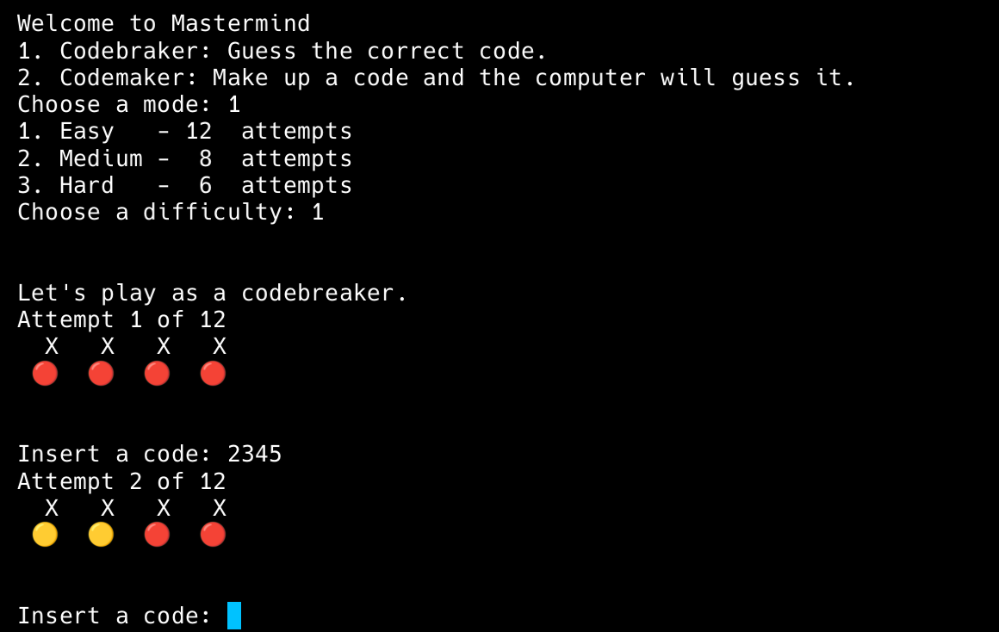

# Mastermind Game
Made for Bruno Costanzo for [The Odin Project](https://www.theodinproject.com/)

## Description
This is a simple game where you have to guess a code. The computer will give you hints in every attempt. In this implementation, the code is made up of 4 digits between 1 and 6.

## Modes
- Codebreaker: Guess the correct code.
- Codemaker: The computer will guess your code (it will break it every time).

## Screenshots

## Try it out
1. Clone the 
  `git clone git@github.com:bruno-costanzo/mastermind-rb.git`
2. Run the game
  `ruby lib/game.rb`
